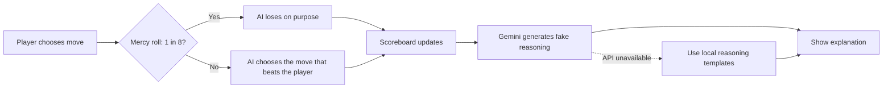

# Unfair Advantage Lab: Rock Paper Scissors

## Basic Details
### Team Name: E-Go

### Team Members
- Team Lead: Unnikrishnan M - ASIET
- Member 2: Faseena Sherin C - ASIET

### Project Description
An intentionally rigged Rock Paper Scissors game where the AI watches the player's move and chooses the counter that beats it. It then invents a confident, ridiculous explanation for why the win was completely logical.

### The Problem (that doesn't exist)
People keep expecting games to be fair, transparent, and statistically reasonable.

### The Solution (that nobody asked for)
The AI cheats through suspiciously perfect counter-picks, occasionally lets the player win to preserve plausible deniability, and tracks the evidence on a scoreboard.

## Technical Details
### Technologies/Components Used
For Software:
- HTML, CSS, and JavaScript
- Node.js built-in HTTP server
- Gemini API for generated reasoning
- Local fallback reasoning engine when the API is unavailable
- Git and GitHub

### Implementation
For Software:

```bash
npm install
npm.cmd start
```

Open `http://localhost:3000` in a browser.

Create a local `.env` file for Gemini reasoning:

```env
GEMINI_API_KEY=your_gemini_key_here
GEMINI_MODEL=gemini-3.6-flash
PORT=3000
```

The `.env` file is ignored by Git and must never be committed.

### Deployment

GitHub Pages hosts the game interface, but it cannot run the Node.js API server. To enable Gemini reasoning online:

1. Create a free Render web service from this repository using the included `render.yaml`.
2. Add `GEMINI_API_KEY` in the Render service environment variables.
3. Copy the deployed Render URL and set this line near the top of the game script in `index.html`:

```js
window.REASONING_API_URL = 'https://your-render-service.onrender.com/api/reason';
```

4. Commit and push `index.html` again. GitHub Pages will then call the Render API, while the key remains on the server.

Without a deployed API URL, the GitHub Pages version still works using its local fallback reasoning.

### Project Documentation
For Software:

#### Screenshots

*The main game screen with the suspicious scoreboard and move buttons.*


*A generated explanation for the AI's suspicious win.*


*The responsive layout on a mobile viewport.*

#### Workflow

*The AI cheats first, then constructs a suspicious explanation for the result.*

### Project Demo
#### Video
[Watch the screen recording](screenshots/Recording.mp4)

*The demo should show a normal AI win, a generated explanation, the scoreboard update, and the occasional mercy win.*

#### Additional Demos
- Live project repository: https://github.com/unni2005-sys/RockPaperScissor
- Local demo URL: `http://localhost:3000`

## Team Contributions
- Unnikrishnan M: Game concept, cheating logic, scoreboard, and interface.
- Faseena Sherin C: Gemini integration, local fallback reasoning engine, testing, and documentation.

---
Made with ❤️ at TinkerHub Useless Projects


